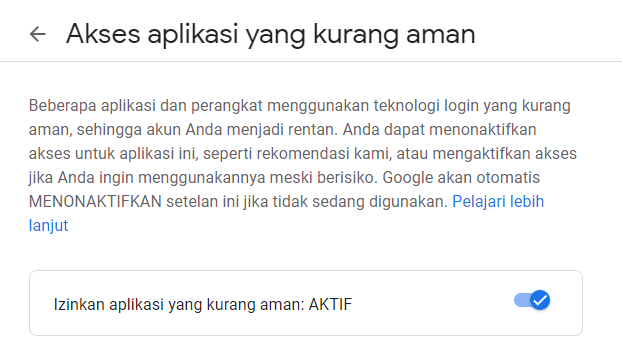

# Send Anonymous Mail

Kirim email anonymous buat ngerjain orang 🤣. Website ini dibuat hanya untuk have fun 🎉, consider this just for learning. Dont forget to follow my github 😶. Happy coding :)

Go to demo : https://hackmail-lrmn.vercel.app

## How to use 🤔

Follow the steps below.

- [Input your email](https://github.com/lrmn7/anonymous-mail/blob/f02ad3c819ce43331240f519ed91c9ad8bbd3c4c/app/main.js#L16-L17)
- [Input your password](https://github.com/lrmn7/anonymous-mail/blob/f02ad3c819ce43331240f519ed91c9ad8bbd3c4c/app/main.js#L16-L17)

- Kamu harus aktifkan "Akses Aplikasi yang kurang aman" di pengaturan akun google kamu ❗
- Direkomendasikan akun email yang kamu pakai adalah akun tumbal atau akun baru ya 😀
- Website ini tidak mengandung unsur hacking atau pencurian akun, soo just relax 👌🏻



## Instalation 💉

```bash
npm install
npm start
```

server : http://localhost:3000

## Features 📃

```javascript
const features = () => {
    return [
        "- Send Email",
        "- Handle Error",
        "- Send Text or HTML",
        "- Sender account already exists"
    ]
}
```

## Contributing
Pull requests are welcome. For major changes, please open an issue first to discuss what you would like to change.

Please make sure to update tests as appropriate.

Don't forget to fork and stars this repo :)

and follow me on github 🙂

## Support me

- 👉 🇮🇩 [Trakteer](https://trakteer.id/lrmn) free access
- 👉 🌍 [BuyMeACoffe](https://www.buymeacoffee.com/lrmn)
- 👉 🌍 [Ko-Fi](https://ko-fi.com/lrmn7)

---

Copyright © 2020 by [L RMN](https://is-a.fun/)
## License
[MIT](https://choosealicense.com/licenses/mit/)
